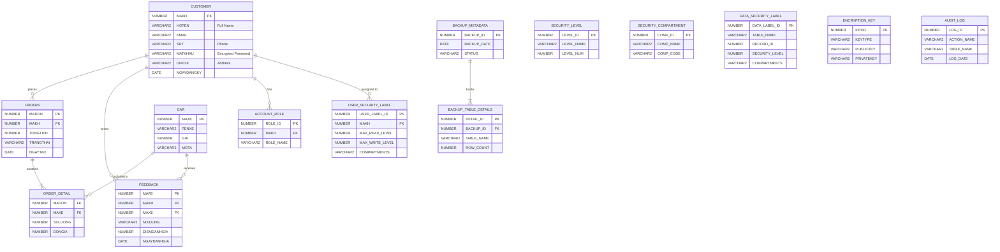

# AutoHub Oracle System

## Introduction
AutoHub Oracle System is a car sales management web application built with **ASP.NET MVC** and **Oracle Database**. This system not only provides standard e-commerce functionalities (managing cars, orders, and customers) but also heavily focuses on advanced database-level security features.

## Key Features
- **Account Management & Authorization**: Role-based access control (RBAC) utilizing the `ACCOUNT_ROLE` table.
- **Car Inventory Management**: CRUD operations for vehicle information.
- **Customer Management**: Secure storage and management of customer data.
- **Order Management**: Create and track order statuses with detailed line items.
- **Feedback**: User rating and review system for cars.
- **Advanced Oracle Database Security**: 
  - Asymmetric Encryption for sensitive data (`DBMS_CRYPTO`).
  - Virtual Private Database (VPD) & Mandatory Access Control (MAC).
- **Audit Logging & Backup**: 
  - Comprehensive system activity tracking via `AUDIT_LOG`.
  - Automated table backup mechanisms (`BACKUP_METADATA`, `BACKUP_TABLE_DETAILS` and `BKP_*` historical tables).

## Tech Stack
- **Backend:** ASP.NET MVC 5.2.9, .NET Framework 4.8, Entity Framework 6.5.1, Oracle.ManagedDataAccess (23.26.0).
- **Frontend:** Bootstrap 5.2.3, jQuery 3.7.0.
- **Database:** Oracle Database 19c/21c.

---

## Entity-Relationship Diagram (ERD)
Below is the comprehensive database schema based on the Oracle tables. This structure is essential for setting up Entity Framework ORM on the backend.

*(Note: Historical backup tables prefixed with `BKP_` such as `BKP_CAR_1`, `BKP_CUSTOMER_1`, etc., are omitted from the diagram for clarity but are managed by the backup metadata tables).*  



---

## Database Setup & SQL Scripts

To get the backend up and running, you need to configure the Oracle Database by executing the provided scripts in the following order.

### 1. User Creation & Privilege Granting (`orcl~1.sql`)
Execute this script using a DBA account (e.g., `SYSTEM/SYSDBA`). It handles the creation of the `CARSALE` user and grants necessary privileges, including VPD, MAC, and Auditing rights.
```sql
-- Run via SQL*Plus or Oracle SQL Developer
@Orcl_DBA/orcl~1.sql
```

### 2. Import Schema & Seed Data (`CARSALE_FULL_BACKUP_20250105.sql`)
This is the full database backup containing the DDL (tables, views, sequences) and initial seed data. 
- **Location**: `Orcl_DBA/CARSALE_FULL_BACKUP_20250105.sql`
- **Action**: Run this script under the newly created `CARSALE` schema. It will construct all core tables (`CUSTOMER`, `CAR`, `ORDERS`, `ORDER_DETAIL`), security tables, backup tracking tables, and set up roles like `CARSALE_ADMIN_ROLE`.

---

## Backend Integration Guide

**1. Database Connection String**
Open the `Web.config` file in the `WebCar` project. Update the `<connectionStrings>` block to match your local Oracle instance:
```xml
<connectionStrings>
    <add name="OracleDbContext" 
         connectionString="Data Source=(DESCRIPTION=(ADDRESS=(PROTOCOL=TCP)(HOST=localhost)(PORT=1521))(CONNECT_DATA=(SERVER=DEDICATED)(SERVICE_NAME=ORCL)));User Id=CARSALE;Password=YourPassword;" 
         providerName="Oracle.ManagedDataAccess.Client" />
</connectionStrings>
```

**2. Restore NuGet Packages**
Open `WebCar.sln` in Visual Studio. Right-click the Solution and select **Restore NuGet Packages** to ensure `EntityFramework 6.5.1` and `Oracle.ManagedDataAccess` are properly installed.

**3. Application Context & Security Labels**
The backend must set the Oracle Application Context immediately after opening a connection if you want VPD (Virtual Private Database) rules to apply correctly based on the logged-in user. This ensures rows in tables like `ORDERS` or `CUSTOMER` are filtered based on the `USER_SECURITY_LABEL`.

---

## Screenshots & Demo (Backend Notes)

### 1. Home Page


> **Backend Integration Note:** The `Index` action fetches the list of available cars via Entity Framework from the `CAR` table. If VPD is active, the database automatically filters out records the current DB session doesn't have the `SECURITY_LEVEL` to view.

### 2. Admin Dashboard


> **Backend Integration Note:** Accessing this dashboard requires the `CARSALE_ADMIN_ROLE`. The backend aggregates data from `CUSTOMER`, `CAR`, and `ORDERS` tables. It also provides quick access to manage Data Security Labels, Users, and initiate Backup & Restore processes.

### 3. Security & Audit Logs


> **Backend Integration Note:** 
> - **Auditing:** Fine-Grained Auditing (FGA) and triggers capture every critical event (`LOGIN`, `UPDATE`, `ACCESS_DENIED`, etc.). These events are directly logged into the `AUDIT_LOG` table and surfaced on this admin view.
> - **Encryption:** Custom logs also indicate events like `CREATE_ORDER_ENCRYPTED`, verifying that sensitive customer data or order details are securely encrypted at the database level using `SYS.DBMS_CRYPTO` before being persisted.

---

## Author

- **Hoài Nam**
- GitHub: [HoaiNam2k5](https://github.com/HoaiNam2k5)

**Last Updated**: 2026  
**Version**: 2.0
